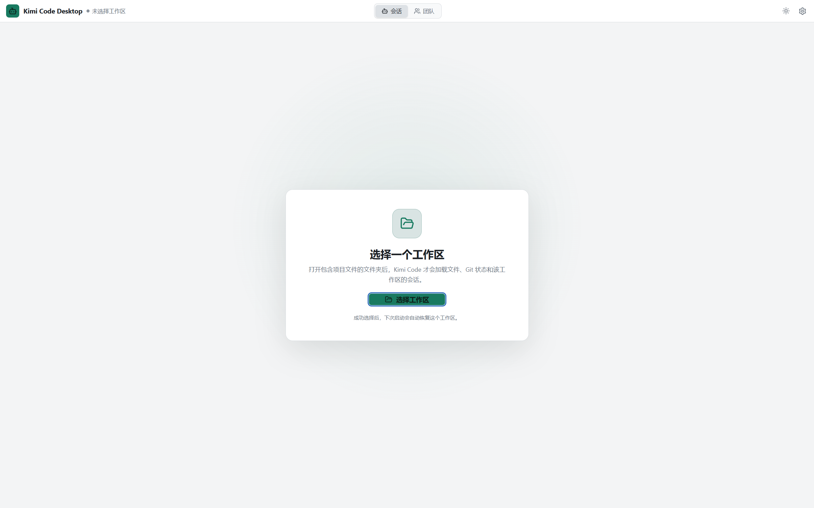
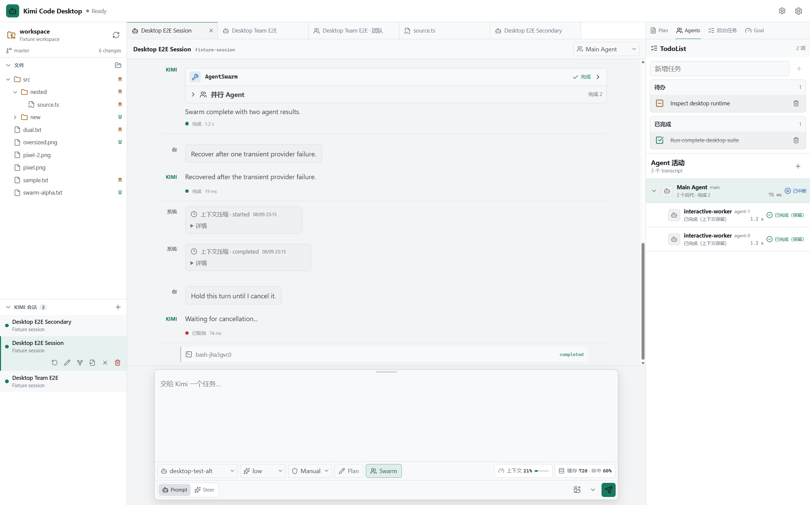
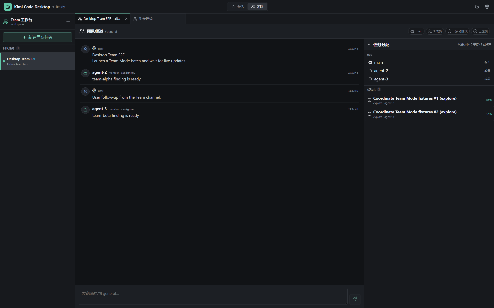
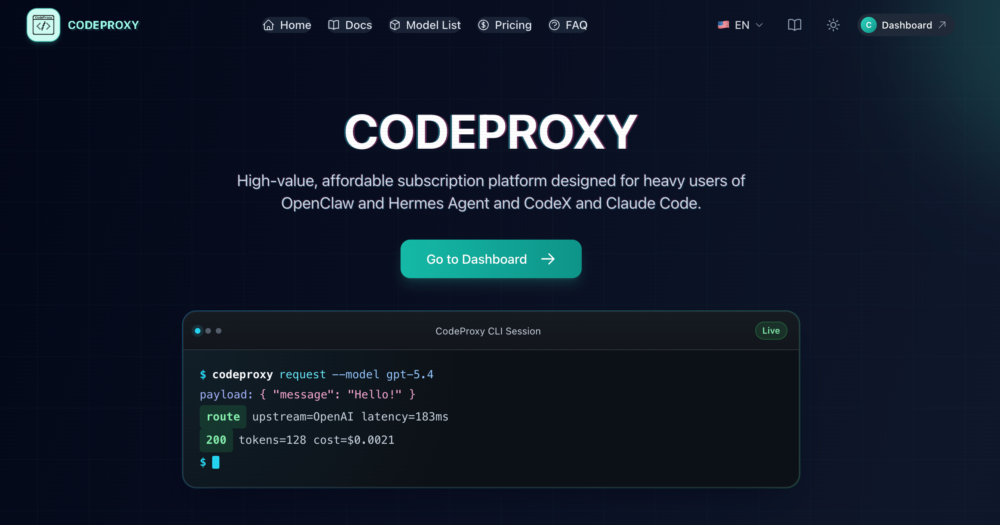

# Kimi Code Desktop

[](LICENSE)

[English](README.en.md) · [第三方许可证](apps/desktop/THIRD_PARTY_NOTICES.md) · [贡献指南](CONTRIBUTING.md) · [安全策略](SECURITY.md)

> [!IMPORTANT]
> 本项目是基于上游 [MoonshotAI/kimi-code](https://github.com/MoonshotAI/kimi-code) 修改的**非官方衍生项目**，不是 Moonshot AI 官方发行版，也不代表 Moonshot AI 的认可或背书。详见 [NOTICE.md](NOTICE.md)。

Kimi Code Desktop 是一个面向 Windows、macOS 和 Linux 的 Electron 桌面工作台，把 Kimi Code 的 Agent 会话、代码编辑、Git 状态、任务面板和多 Agent 协作放进同一个原生窗口。仓库同时保留上游 CLI、SDK 和引擎包；当前首页以 Desktop 产品为主。

## 界面预览

### 首次启动



### 完整工作台



### 独立 Team 工作台



截图由隔离的本地 E2E fixture 生成，已移除本机路径、真实会话和凭据信息。

## 主要功能

- **会话工作台**：持久化 Kimi 会话、流式对话时间线、审批与提问、上下文状态、Plan、Goal、TodoList 和后台任务集中展示。
- **代码与 Git**：工作区文件树、Git 状态聚合、Git diff 标签页，以及内置 Monaco Editor；支持保存、搜索、撤销和脏文件关闭确认。
- **Agent 可观测性**：查看主 Agent、子 Agent 和并行任务的运行、完成、失败与交互状态。
- **独立 Team 工作台**：在顶层“团队”面板中管理多 Agent 任务、频道、具名成员、职业分工、未读消息和 Agent 详情；频道使用左右气泡区分用户与 Agent，并支持 Markdown 换行和可点击的 `@提及`。
- **配置与扩展**：在 Desktop 内管理登录、模型、MCP、Skills、Plugins、诊断和工作区信任。
- **安全边界**：渲染进程启用 sandbox 和 context isolation，只能通过经过校验的 `window.kimiDesktop` IPC 调用主进程能力。

## 下载与运行

`desktop-v*` 标签会触发 GitHub Actions，在目标系统原生构建以下安装包。前往本仓库的 [GitHub Releases](../../releases) 下载：

- `Kimi-Code-Desktop-0.4.0-x64-portable.exe`
- `Kimi-Code-Desktop-0.4.0-arm64.dmg`
- `Kimi-Code-Desktop-0.4.0-x64.AppImage`
- `Kimi-Code-Desktop-0.4.0-x64.deb`

每个安装包都带有同名 `.sha256` 文件，例如 Windows x64 便携版对应 `Kimi-Code-Desktop-0.4.0-x64-portable.exe.sha256`。

下载后可在 PowerShell 校验 SHA256：

```powershell
$exe = ".\Kimi-Code-Desktop-0.4.0-x64-portable.exe"
$expected = (Get-Content "$exe.sha256").Split()[0]
$actual = (Get-FileHash $exe -Algorithm SHA256).Hash.ToLowerInvariant()
$actual -eq $expected
```

返回 `True` 后直接运行 EXE，无需预装 Node.js 或 pnpm。macOS 和 Linux 可用系统自带工具校验：

```bash
shasum -a 256 -c Kimi-Code-Desktop-0.4.0-arm64.dmg.sha256
sha256sum -c Kimi-Code-Desktop-0.4.0-x64.AppImage.sha256
sha256sum -c Kimi-Code-Desktop-0.4.0-x64.deb.sha256
```

macOS arm64 用户挂载 DMG 后将应用拖入“应用程序”。该构建未签名，首次打开时可在 Finder 中右键应用并选择“打开”；如系统仍保留下载隔离标记，可执行：

```bash
xattr -dr com.apple.quarantine "/Applications/Kimi Code Desktop.app"
open "/Applications/Kimi Code Desktop.app"
```

Linux x64 用户可任选一种方式：

```bash
chmod +x Kimi-Code-Desktop-0.4.0-x64.AppImage
./Kimi-Code-Desktop-0.4.0-x64.AppImage

sudo apt install ./Kimi-Code-Desktop-0.4.0-x64.deb
```

当前 Windows 与 macOS 自动构建默认**不做代码签名**，系统可能在首次运行时显示确认提示。请先核对下载来源和 SHA256；后续取得代码签名证书后会单独接入发布流程。

## 首次选择工作区

首次启动时 Desktop 不会自动扫描磁盘，而是停留在欢迎页：

1. 点击“选择工作区”。
2. 选择一个已有项目目录。
3. Desktop 加载文件、Git 状态和该工作区的会话。

选择结果保存在本地并在下次启动时恢复；如果目录已被移动或删除，应用会安全回到欢迎页。`KIMI_DESKTOP_WORKSPACE` 仅用于需要显式覆盖启动目录的开发或自动化场景。

## 独立 Team 工作台

Team 是 Desktop 的独立顶层工作台，无需手动设置实验开关：

1. 点击窗口顶部的“团队”。
2. 点击“新建团队任务”，填写目标、约束和验收标准。
3. 选择沿用当前默认权限，或仅为该任务使用 YOLO。
4. 在 `general` 频道跟进工作；点击成员或任务分配可打开对应 Agent 详情。

每个团队任务使用单独的持久化会话。用户消息写入频道后会主动唤醒组长：空闲组长开始协作回合，正在工作的组长则接收 steer 更新。组长会按任务分别选择 `explore`、`coder` 等职业并为 Agent 命名，而不是让整批成员共享同一职业；名称和职业随团队状态持久化，并用于频道、标签页和任务树展示。找不到合适职业时，组长可在审批后用 `AgentProfileCreate` 创建项目级可复用 Profile，也可显式选择用户级作用域。

频道消息以固定上限的气泡展示，长消息在气泡内部滚动；单换行按原样显示，`@显示名` 与 `@agent-id` 会高亮，点击即可打开对应 Agent。成员通过 `TeamSend`、`TeamStatus` 和 `TeamWait` 共享进展、阻塞和交付结果。文件读写记录仍可点击打开目标文件；编辑操作直接显示操作前后差异。旧版本已经产生 Team 数据的会话会在恢复时安全迁移到团队列表。

## 架构边界

```text
Sandboxed React renderer
        │ validated window.kimiDesktop IPC
        ▼
Electron preload + main process
        │ public @moonshot-ai/kimi-code-sdk
        ▼
Kimi harness / session runtime / workspace filesystem
```

- Electron 主进程持有应用级 Kimi harness、会话 runtime、文件系统和原生窗口能力。
- preload 只暴露经过命令 schema 校验的 IPC；渲染进程没有 Node.js、文件系统或原始密钥访问权。
- Desktop 通过公开的 `@moonshot-ai/kimi-code-sdk` 和 `@moonshot-ai/transcript` 使用核心能力，不直接依赖引擎内部 API。
- 本仓库不再包含浏览器 Web UI 源码；上游 Web bundle 的同步方式见根目录 [AGENTS.md](AGENTS.md)。

## 核心开源组件

本项目建立在以下开源项目之上：

- [Kimi Code](https://github.com/MoonshotAI/kimi-code)
- [Electron](https://github.com/electron/electron)
- [React](https://react.dev/)
- [Monaco Editor](https://github.com/microsoft/monaco-editor)
- [TanStack Virtual](https://tanstack.com/virtual)
- [React Markdown](https://github.com/remarkjs/react-markdown)
- [Chokidar](https://github.com/paulmillr/chokidar)
- [Lucide](https://lucide.dev/)
- [Zod](https://zod.dev/)
- [Vite](https://vite.dev/)、[Vitest](https://vitest.dev/) 和 [Playwright](https://playwright.dev/)
- [tsdown](https://tsdown.dev/) 和 [electron-builder](https://github.com/electron-userland/electron-builder)

完整的 Desktop 生产依赖版本、SPDX 表达式、主页和许可证正文见 [`apps/desktop/THIRD_PARTY_NOTICES.md`](apps/desktop/THIRD_PARTY_NOTICES.md)。Windows 包同时携带仓库 MIT License、项目 NOTICE、第三方清单，以及 Electron 自带的 Electron/Chromium 许可证文件。

## 从源码构建

环境要求：Windows、Node.js `>=24.15.0`（推荐 `.nvmrc` 中的版本）、pnpm `10.33.0`、Git。

```powershell
git clone <repository-url>
cd <repository-directory>
fnm exec --using=24.15.0 -- pnpm install --frozen-lockfile
fnm exec --using=24.15.0 -- pnpm --filter @moonshot-ai/kimi-code-desktop licenses:check
fnm exec --using=24.15.0 -- pnpm --filter @moonshot-ai/kimi-code-desktop test
fnm exec --using=24.15.0 -- pnpm --filter @moonshot-ai/kimi-code-desktop typecheck
fnm exec --using=24.15.0 -- pnpm --filter @moonshot-ai/kimi-code-desktop build
fnm exec --using=24.15.0 -- pnpm --filter @moonshot-ai/kimi-code-desktop start
```

生成未打包目录或便携 EXE：

```powershell
fnm exec --using=24.15.0 -- pnpm --filter @moonshot-ai/kimi-code-desktop pack:win
fnm exec --using=24.15.0 -- pnpm --filter @moonshot-ai/kimi-code-desktop dist:win
```

依赖变化后运行 `licenses:generate` 更新第三方清单；`pack:win` 和 `dist:win` 会先执行 `licenses:check`，清单陈旧时直接失败。

## 目录结构

| 路径 | 作用 |
| --- | --- |
| `apps/desktop` | Electron 主进程、preload、React 渲染器、E2E 与 Windows 打包配置 |
| `apps/kimi-code` | 保留的 Kimi Code CLI / TUI 应用 |
| `packages/node-sdk` | Desktop 使用的公开 Node SDK |
| `packages/transcript` | 与引擎解耦的 transcript 数据层 |
| `packages/agent-core-v2` | Desktop SDK 背后的 DI × Scope Agent 引擎 |
| `packages/kap-server` / `packages/klient` | 服务端与契约驱动客户端能力 |

## 贡献与安全

提交前请阅读 [CONTRIBUTING.md](CONTRIBUTING.md)，保持改动聚焦，并运行相关测试、类型检查和许可证检查。安全问题请按 [SECURITY.md](SECURITY.md) 私下报告，不要创建公开 Issue。

## 感谢赞助

感谢 [CodeProxy](https://codeproxy.dev/) 对本项目开发与开源发布的支持。

[](https://codeproxy.dev/)

## 许可证与归属

上游代码及本项目修改继续采用 [MIT License](LICENSE)。根 `LICENSE` 保留上游版权原文；第三方依赖按各自许可证分发。项目归属、非官方声明和商标说明见 [NOTICE.md](NOTICE.md)。
